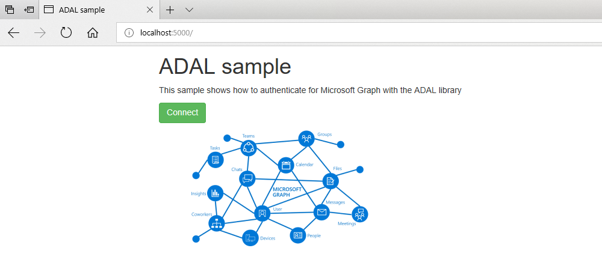
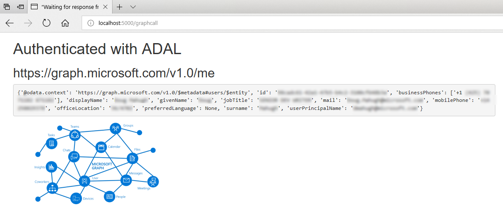

# Python authentication samples for Microsoft Graph

  

To make calls to [Microsoft Graph](https://developer.microsoft.com/en-us/graph/), your app must obtain a valid access token from Azure Active Directory (Azure AD), the Microsoft cloud identity service, and the token must be passed in an HTTP header with each call to the Microsoft Graph REST API. You can acquire access tokens via industry-standard [OAuth 2.0](https://tools.ietf.org/html/rfc6749) and [Open ID Connect](http://openid.net/connect/) protocols, and use an [Azure Active Directory v2.0 authentication library](https://docs.microsoft.com/en-us/azure/active-directory/develop/active-directory-v2-libraries) to implement those protocols.

This repo includes examples of four different approaches you can use to authenticate with Azure AD from a Python web application. Each sample implements the OAuth 2.0 [Authorization Code Grant](https://tools.ietf.org/html/rfc6749#section-4.1) workflow, which is the recommended approach for web applications written in Python.

* [Sample architecture](#sample-architecture)
* [Python auth options](#python-auth-options)
* [Using the samples](#using-the-samples)
* [Contributing](#contributing)
* [Resources](#resources)

## Sample architecture

The samples in this repo all do the same thing: prompt the user to log on, and then display their user profile data as JSON. All samples use the same names for variables, functions, and routes, and they also use the same HTML templates and CSS, to make it easy to see how the implementation details vary between different auth libraries.

The following diagram shows how each sample implements the Authorization Code Grant workflow.


Each ```sample_*.py``` source file has the same structure:

1. **initial setup** &mdash; Read configuration settings and instantiate auth provider.
2. **homepage()** &mdash; Static page with a /login button.
3. **login()** &mdash; Call auth provider to authenticate user, Azure AD returns authorization code.
4. **authorize()** (Redirect URI) &mdash; Use authorization code to request/save token, redirect to /graphcall.
5. **graphcall()** &mdash; Query Microsoft Graph and display returned data.

You can modify the samples to test specific Microsoft Graph calls you'd like to make by changing the endpoint, and changing the requested permissions to what that endpoint requires. For example, to retrieve your email messages instead of user profile data, change the ```/me``` endpoint to ```/me/messages``` and add ```Mail.Read``` to the list of permissions requested in the SCOPES setting of ```config.py```. With those changes, the sample will display a JSON document that contains the top ten messages from your mailbox.

Note that these samples are intended to clarify the minimum steps required for authenticating and making calls to Microsoft Graph. They don't include error handling and other common practices for production deployment.

## Python auth options

The following is a summary of the authentication options that the code samples in this repo demonstrate.

### Microsoft ADAL (sample_adal.py)

The [sample_adal.py](https://github.com/microsoftgraph/python-sample-auth/blob/master/sample_adal.py) sample shows how to use the [Microsoft Azure Active Directory Authentication Library (ADAL) for Python](https://github.com/AzureAD/azure-activedirectory-library-for-python) for authentication to Microsoft Graph. ADAL supports a variety of token acquisition methods and can be used for other Azure AD authentication scenarios in addition to working with Microsoft Graph. ADAL does not provide support for [Microsoft Accounts](https://account.microsoft.com/account/Account) or [incremental consent](https://docs.microsoft.com/en-us/azure/active-directory/develop/active-directory-v2-compare#incremental-and-dynamic-consent). If you need those capabilities, one of the other options might be a better fit.

In addition to [sample_adal.py](https://github.com/microsoftgraph/python-sample-auth/blob/master/sample_adal.py), which uses the Flask web framework, a [sample_adal_bottle.py](https://github.com/microsoftgraph/python-sample-auth/blob/master/sample_adal_bottle.py) version is provided, which uses the Bottle web framework.

### Flask-OAuthlib (sample_flask.py)

If you're building a [Flask](http://flask.pocoo.org/)-based web application, the [Flask-OAuthlib](https://flask-oauthlib.readthedocs.io/en/latest/) provides a simple way to authenticate with Azure AD for Microsoft Graph. The [sample_flask.py](https://github.com/microsoftgraph/python-sample-auth/blob/master/sample_flask.py) sample shows how to use Flask-OAuthlib to authenticate to Microsoft Graph.

### Request-OAuthlib (sample_requests.py)

If you're using [Requests](http://docs.python-requests.org/en/master/), the most popular HTTP library for Python developers, [Requests-OAuthlib](https://github.com/requests/requests-oauthlib) is a good option for Microsoft Graph authentication. The [sample_requests.py](https://github.com/microsoftgraph/python-sample-auth/blob/master/sample_requests.py) sample shows how to use Requests-OAuthlib to authenticate to Microsoft Graph from a Bottle web app.

### graphrest module (sample_graphrest.py)

If you're interested in developing your own authentication module, or are curious about the details of implementing OAuth 2.0 authentication for a web application, the [sample_graphrest.py](https://github.com/microsoftgraph/python-sample-auth/blob/master/sample_graphrest.py) sample provides an example of authenticating with [graphrest](https://github.com/microsoftgraph/python-sample-auth/blob/master/graphrest.py), a custom auth library written in Python. Note that this sample uses the [Bottle](https://bottlepy.org/docs/dev/) web framework, although it is relatively easy to port it to Flask or any other web framework that supports redirects and provides access to request query parameters.

## Using the samples

The following instructions take you through the steps required to install, configure, and run the samples.

### Prerequisites

Before installing the sample:

* Install Python from [https://www.python.org/](https://www.python.org/). We've tested the code with Python 3.6.2, but any Python 3.x version should work fine. If your code base is running under Python 2.7, you may find it helpful to use the [3to2](https://pypi.python.org/pypi/3to2) tools to port the code to Python 2.7.
* To register your application for access to Microsoft Graph, you'll need either a [Microsoft account](https://www.outlook.com) or an [Office 365 for business account](https://msdn.microsoft.com/en-us/office/office365/howto/setup-development-environment#bk_Office365Account). If you don't have one of these, you can create a Microsoft account for free at [outlook.com](https://www.outlook.com).

### Installation

Follow these steps to install the samples:

1. Clone this repo: ```git clone https://github.com/microsoftgraph/python-sample-auth.git```.
2. Create and activate a virtual environment (optional). If you're new to Python virtual environments, [Miniconda](https://conda.io/miniconda.html) is a great place to start.
3. In the root folder of your cloned repo, install the dependencies for the sample as listed in [requirements.txt](https://github.com/microsoftgraph/python-sample-auth/blob/master/requirements.txt) with this command: ```pip install -r requirements.txt```.

Following the above steps will install all the dependencies for all four options. If you only plan to use one of the options, the following table lists the Python package dependencies for each sample.

| Sample | Auth Library | Dependencies |
| ------ | ------------ | ------------ |
| [sample_adal.py](https://github.com/microsoftgraph/python-sample-auth/blob/master/sample_adal.py) | [Microsoft ADAL](https://github.com/AzureAD/azure-activedirectory-library-for-python) | <ul><li>adal</li><li>requests</li><li>flask</li></ul> |
| [sample_flask.py](https://github.com/microsoftgraph/python-sample-auth/blob/master/sample_flask.py) | [Flask-OAuthlib](https://flask-oauthlib.readthedocs.io/en/latest/) | <ul><li>flask</li><li>flask-oauthlib</li></ul> |
| [sample_requests.py](https://github.com/microsoftgraph/python-sample-auth/blob/master/sample_requests.py) | [Requests-OAuthlib](https://github.com/requests/requests-oauthlib) | <ul><li>requests</li><li>requests-oauthlib</li><li>bottle</li></ul> |
| [sample_graphrest.py](https://github.com/microsoftgraph/python-sample-auth/blob/master/sample_graphrest.py) | [graphrest module](https://github.com/microsoftgraph/python-sample-auth/blob/master/graphrest.py) | <ul><li>requests</li><li>bottle</li></ul> |

### Configuration

To configure the samples, you'll need to register a new application in the Microsoft [Application Registration Portal](https://apps.dev.microsoft.com/). You only need to do this once, and then any Microsoft identity can be used to run any of the samples.

Follow these steps to register a new application:

1. Sign in to the [Application Registration Portal](https://apps.dev.microsoft.com/) using either your personal or work or school account.

2. Under **My applications**, choose **Add an app**. If you're using an Office 365 account and see two categories listed (Converged or Azure AD only), choose **Add an app** for the Converged applications section.

3. Enter an application name, and choose **Create**. (Do *not* choose **Guided Setup**.)

4. Next you'll see the registration page for your app. Copy and save the **Application Id** field.You will need it later to complete the configuration process.

5. Under **Application Secrets**, choose **Generate New Password**. A new password will be displayed in the **New password generated** dialog. Copy this password. You will need it later to complete the configuration process.

6. Under **Platforms**, choose **Add platform** > **Web**.

7. Enter `http://localhost:5000/login/authorized` as the Redirect URL, and then choose **Save**.

As the final step in configuring the sample, modify the [config.py](https://github.com/microsoftgraph/python-sample-auth/blob/master/config.py) file in the root folder of your cloned repo, and follow the instructions to enter your Client ID and Client Secret (which are referred to as Application Id and Password in the app registration portal). Then save the change, and you're ready to run the samples.

### Running the samples

To run one of the samples, run the command ```python <progname>``` in the root folder of the cloned repo. For example, to run the ADAL sample, use this command: ```python sample_adal.py```.

Then go to this URL in a browser: [http://localhost:5000](http://localhost:5000)

You should see a home page like this:



Choose **Connect**, and then select your Microsoft account or Office 365 account and follow the instructions to log on.

The first time you log on to the app under a particular identity, you will be prompted to consent to the permissions that the app is requesting. Choose **Accept**, which gives the application permission to read your profile information.

You'll then see the following screen, which shows that the app has successfully read your profile information from Microsoft Graph:



## Contributing

These samples are open source, released under the [MIT License](https://github.com/microsoftgraph/python-sample-auth/blob/master/LICENSE). Issues (including feature requests and/or questions about this sample) and [pull requests](https://github.com/microsoftgraph/python-sample-auth/pulls) are welcome. If there's another Python sample you'd like to see for Microsoft Graph, we're interested in that feedback as well &mdash; please log an [issue](https://github.com/microsoftgraph/python-sample-auth/issues) and let us know!

This project has adopted the [Microsoft Open Source Code of Conduct](https://opensource.microsoft.com/codeofconduct/). For more information, see the [Code of Conduct FAQ](https://opensource.microsoft.com/codeofconduct/faq/) or contact [opencode@microsoft.com](mailto:opencode@microsoft.com) with any additional questions or comments.

## Resources

* [Microsoft Graph Dev Center](https://developer.microsoft.com/en-us/graph/)
* [Get started with Microsoft Graph and REST](https://developer.microsoft.com/en-us/graph/docs/concepts/rest)
* [Get access tokens to call Microsoft Graph](https://developer.microsoft.com/en-us/graph/docs/concepts/sample_overview)
* [Authorize access to web applications using OAuth 2.0 and Azure Active Directory](https://docs.microsoft.com/en-us/azure/active-directory/develop/active-directory-protocols-oauth-code)
* [Microsoft ADAL for Python](https://github.com/AzureAD/azure-activedirectory-library-for-python)
* [Flask-Oauthlib](https://flask-oauthlib.readthedocs.io/en/latest/)
* [Requests-Oauthlib](https://media.readthedocs.org/pdf/requests-oauthlib/latest/requests-oauthlib.pdf)
* [Azure Active Directory v2.0 authentication libraries](https://docs.microsoft.com/en-us/azure/active-directory/develop/active-directory-v2-libraries)
* [Oauth 2.0 specification](http://www.rfc-editor.org/rfc/rfc6749.txt)
* [Open ID Connect specifications](http://openid.net/connect/)
